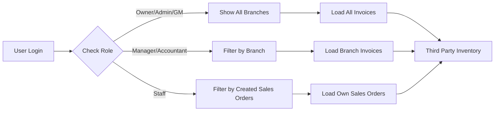

# 🔐 Third Party Inventory Governance Rules

## 📋 Overview

This document describes the data visibility and access control rules for the **Third Party Inventory** (بضائع لدى الغير) page.

---

## 🎯 Governance Rules

### 👑 **Owner / Admin / General Manager**

**Access Level:** Company-wide (Cross-Branch)

✅ **Can See:**
- All third-party goods across all branches
- All invoices with shipping providers
- All sales orders

❌ **Cannot See:**
- N/A (Full access)

**Filter Applied:**
```sql
company_id = user.company_id
```

---

### 🏢 **Branch Manager / Accountant**

**Access Level:** Branch-scoped

✅ **Can See:**
- Third-party goods from their assigned branch only
- Invoices from their branch
- Sales orders from their branch

❌ **Cannot See:**
- Goods from other branches
- Invoices from other branches

**Filter Applied:**
```sql
company_id = user.company_id
AND branch_id = user.branch_id
```

---

### 👨‍💼 **Staff / Sales / Employee**

**Access Level:** Own data only

✅ **Can See:**
- Third-party goods from sales orders **they created**
- Only invoices linked to their sales orders

❌ **Cannot See:**
- Goods from sales orders created by other users
- Goods from other branches

**Filter Applied:**
```sql
company_id = user.company_id
AND EXISTS (
  SELECT 1 FROM invoices inv
  INNER JOIN sales_orders so ON inv.sales_order_id = so.id
  WHERE inv.id = third_party_inventory.invoice_id
  AND so.created_by_user_id = user.id
)
```

**Relationship Chain:**
```
Sales Order (created_by_user_id) → Invoice (sales_order_id) → Third Party Inventory (invoice_id)
```

---

## 🛡️ Security Layers

### **1️⃣ Database RLS (Row Level Security)**

**File:** `scripts/apply_third_party_inventory_governance.sql`

**Policy:** `third_party_inventory_select_governance`

**Purpose:** Enforce access control at the database level to prevent unauthorized access even if frontend is bypassed.

**Key Features:**
- Prevents direct database queries from bypassing governance
- Ensures data isolation between branches
- Protects staff data from unauthorized access

---

### **2️⃣ Frontend Filtering**

**File:** `app/inventory/third-party/page.tsx`

**Implementation:**
```typescript
// 🔐 Apply governance rules
const currentRole = memberData?.role || "staff"
const currentBranchId = memberData?.branch_id || null

if (currentRole === 'manager' || currentRole === 'accountant') {
  // Branch-scoped: Filter by branch_id
  if (currentBranchId) {
    invoicesQuery = invoicesQuery.eq("branch_id", currentBranchId)
  }
} else if (currentRole === 'staff' || currentRole === 'sales') {
  // Own data only: RLS handles filtering via sales_order.created_by_user_id
}
```

**Purpose:** Optimize performance by reducing data transfer and provide immediate feedback.

---

### **3️⃣ UI Visibility Notice**

**Implementation:**
```typescript
{currentUserRole === 'manager' || currentUserRole === 'accountant' ? (
  <p className="text-xs text-blue-600">
    🏢 تعرض البضائع الخاصة بفرعك فقط
  </p>
) : currentUserRole === 'staff' ? (
  <p className="text-xs text-blue-600">
    👨‍💼 تعرض البضائع من أوامر البيع التي أنشأتها فقط
  </p>
) : null}
```

**Purpose:** Inform users about their data visibility scope.

---

## 📊 Data Flow



---

## 🧪 Testing Scenarios

### **Test 1: Owner Access**
1. Login as Owner
2. Navigate to Third Party Inventory page
3. ✅ Should see all goods from all branches

### **Test 2: Branch Manager Access**
1. Login as Branch Manager (assigned to Branch A)
2. Navigate to Third Party Inventory page
3. ✅ Should see only goods from Branch A
4. ❌ Should NOT see goods from Branch B

### **Test 3: Staff Access**
1. Login as Staff User A
2. Create Sales Order SO-001
3. Convert to Invoice INV-001 with shipping provider
4. Navigate to Third Party Inventory page
5. ✅ Should see goods from INV-001
6. ❌ Should NOT see goods from invoices created by other staff

---

## 🔧 Implementation Files

| File | Purpose |
|------|---------|
| `scripts/apply_third_party_inventory_governance.sql` | Database RLS policies |
| `app/inventory/third-party/page.tsx` | Frontend filtering and UI |
| `docs/THIRD_PARTY_INVENTORY_GOVERNANCE.md` | This documentation |

---

## 📝 Notes

1. **RLS is the primary security layer** - Frontend filtering is for performance optimization only
2. **Staff filtering is complex** - Requires JOIN between `third_party_inventory`, `invoices`, and `sales_orders`
3. **Branch-scoped roles** - Manager and Accountant have the same visibility rules
4. **Cross-branch visibility** - Only Owner, Admin, and General Manager can see all branches

---

## 🚀 Deployment Steps

1. **Execute SQL Script:**
   ```sql
   -- In Supabase SQL Editor
   \i scripts/apply_third_party_inventory_governance.sql
   ```

2. **Deploy Frontend:**
   ```bash
   git pull origin main
   npm run build
   ```

3. **Test Access:**
   - Test with Owner account
   - Test with Branch Manager account
   - Test with Staff account

---

**Last Updated:** 2026-01-30  
**Version:** 1.0  
**Status:** ✅ Implemented

