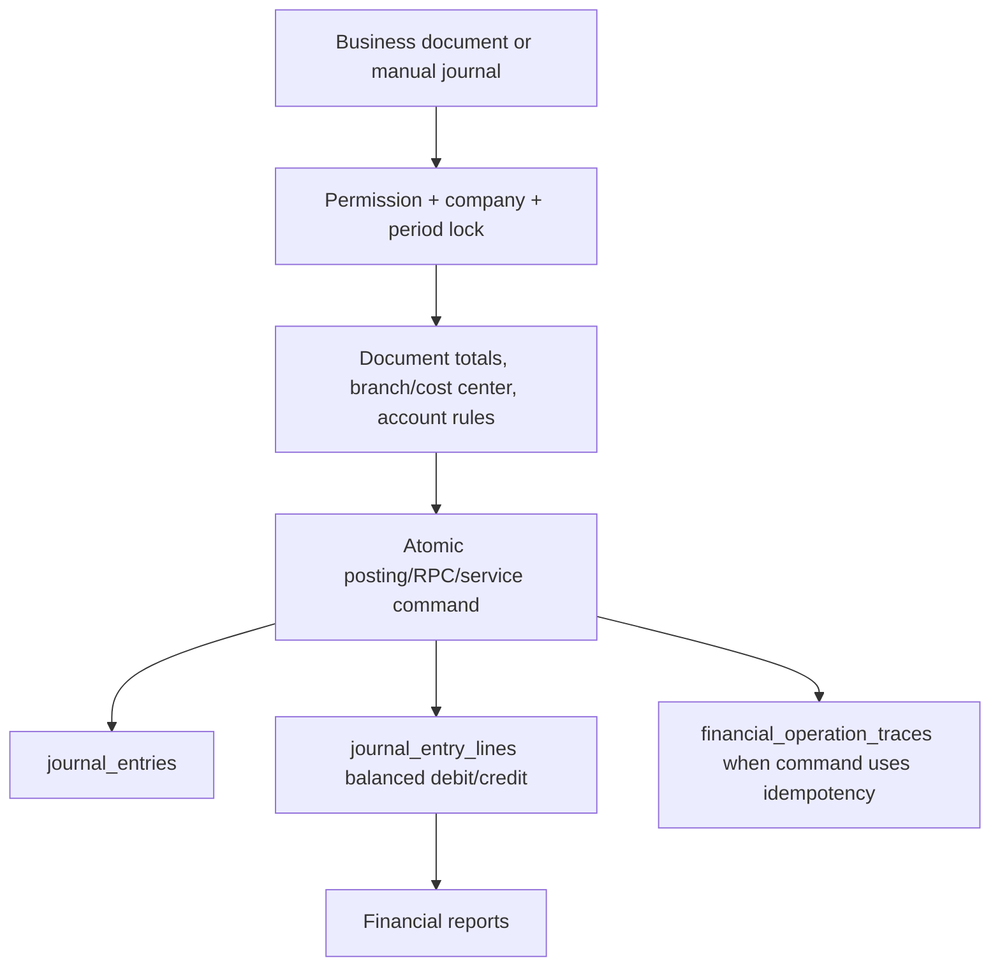

# Accounting Module

> Verified from repo structure and code on 2026-07-12. For table/function detail, see `knowledge/database/*.md`.

## الهدف

إدارة القيود اليومية، شجرة الحسابات، التقارير المالية، إقفال الفترات، الأصول الثابتة، إعادة تقييم العملات، ورأس المال/حقوق الملكية.

## الوظائف

- Manual journals: `app/journal-entries`, `app/api/journal-entries/manual/route.ts`.
- Core posting engine: `lib/accounting-transaction-service.ts`, `lib/services/finance/journal-service.ts`.
- Period lock/closing: `lib/accounting-period-lock.ts`, `lib/period-closing.ts`, `app/accounting/periods`, `app/accounting/period-closing`.
- Reports: trial balance, balance sheet, income statement, cash flow, VAT, aging AR/AP, GL summary under `app/reports`.
- Fixed assets/depreciation: `app/fixed-assets`, `app/api/fixed-assets`, migrations `20260214_006` through `20260214_010`.
- FX: `lib/fx-revaluation.ts`, `lib/exchange-rates.ts`, `app/api/fx-revaluation`.

## Workflow

## العلاقات

- Sales, purchases, payments, returns, write-offs, manufacturing, assets, payroll, and equity all post to journals.
- Inventory flows add `cogs_transactions` alongside accounting lines.
- Period lock blocks back-dated financial mutations.

## Permissions

- Financial reports use `financial_reports` resource where wired.
- Journal/manual posting routes must be treated as high-risk and guarded server-side.
- `owner/admin` bypass RBAC, but DB constraints still apply.

## Business Rules

- Every financial posting must be balanced.
- Posted documents should be reversed/voided, not edited in place.
- Financial period locks protect closed/back-dated periods.
- Branch and cost-center context is part of governance, not decoration.

## Database Tables

`chart_of_accounts`, `journal_entries`, `journal_entry_lines`, `accounting_periods`, `financial_operation_traces`, `financial_operation_trace_links`, `fixed_assets`, `asset_categories`, `depreciation_schedules`, `capital_contributions`, plus document-specific tables.

## APIs

- `/api/finance/journals`
- `/api/journal-entries/manual`
- `/api/trial-balance`
- `/api/general-ledger`
- `/api/income-statement`
- `/api/cash-flow`
- `/api/accounting-periods`
- `/api/accounting-periods/lock`
- `/api/accounting-periods/unlock`
- `/api/period-closing`
- `/api/fx-revaluation`
- `/api/fixed-assets/*`

## الأحداث والإشعارات

Accounting changes often emit notifications indirectly through document command services rather than a standalone accounting notification layer.

## Validation Rules

- Balanced debit/credit.
- Open financial period.
- Valid account IDs and branch/company scope.
- Do not post duplicate journal entries for the same business event.

## Edge Cases

- Some maintenance routes exist for historical repairs; guard coverage should be audited before reuse.
- Reports may use corrected/base-currency amounts depending on migration lineage; inspect relevant report service before changing formulas.

